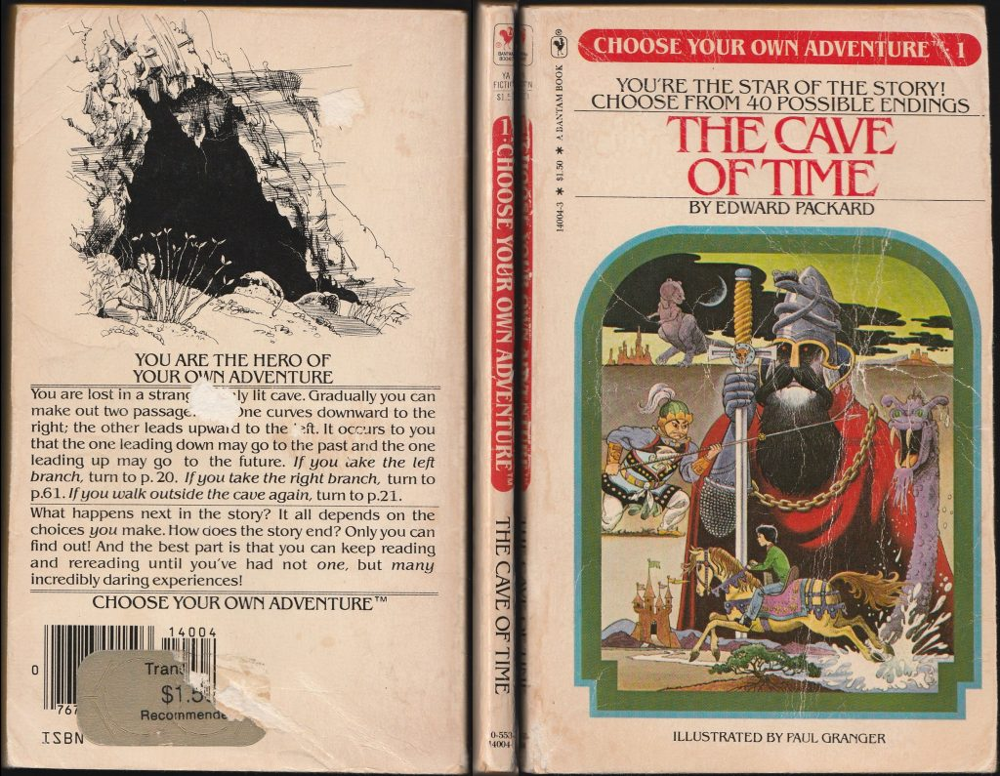

# Beginning Interactive Fiction with Twine 2

> You step into the pantry thinking about spice combinations when the door slams shut behind you. A lock snaps into place with a loud click. The pantry light goes out.

> You turn on your heels to see a pair of twisted yellow eyes in the dark. The corners are bloodshot and savage. From the faint light spilling underneath the pantry door, you manage to see the serrated edge of a knife, pointed directly at you.

> Do you:

> ♦️ Kick at the stranger in the dark.

> ♦️ Ask, “What do you want?”

> ♦️ Step backward, feeling for something heavy.

So begins a story that may leave you scrambling through a house with a killer at your heels. Or its a story of epic pranks that grow out of control. Or maybe its the beginning of an inter dimensional chase with the fate of civilization hanging in the balance. The ultimate outcome of the story isn’t determined by the writer. Rather, it’s the reader who makes the journey.

Welcome to the world of interactive fiction. Interactive fiction has been humanity since people have been able to tell stories, but it exploded into popularity with the release of the Choose Your Adventure series. This was a series of pulp adventures that provided branching stories to the reader. This meant the book would change with every subsequent rereading.

Following the popularity of Choose Your Adventure, tabletop games such as Dungeons and Dragons appeared, allowing people to star in their own fantasy stories where outcomes were controlled by player choice and dice rolls. When first designed, Dungeons and Dragons was about exploring dungeons, and fighting – well, you guessed it – dragons (among other creatures). The game at its core is an imagination exercise whereby each player contributes to the story.

Dungeons and Dragons, at its heart, is a collaborative storytelling game where the “writer” and “readers” collectively create pulp fantasy adventures.

It wasn’t long before interactive fiction spilled into computers. Games such as The Colossal Cave and Zork allowed players to play a central role in an adventure. At first, these games were simple environments where the player needed to solve puzzles. In the time, they evolved in evocative tales with serious themes. For example, the game Trinity explored the social impacts of nuclear weapons in the fifty years since they were created.

Since the eighties, interactive fiction has continued to blossom in games, movies and entertainment. While text games are no longer produced by commercial game developers, there is a strong demand for branching narratives. Games like The Outer Worlds, Fallout and Skyrim may feature action orientated combat, but the principal engine is the branching narrative. Branching narratives gives the players agency and makes them feel involved in their world.

Thankfully, the tools to create interactive stories are accessible and easy to use. While it may take some coding to employ some advanced features, it’s the story that keeps people playing long after novelty has worn off.

While The Outer Worlds is classified as an action role playing game, it is – at it’s heart – a branching interactive fiction game.

There are lots of different interactive fiction engines out there. My personal favorite is the Twine engine. Twine allows you to create multiple choice style adventures, much like the Choose Your Own Adventure books. I like Twine because it is well suited for the mobile age. You can play Twine games on your phone or desktop. They don’t require typing and stories don’t get roadblocked by “verb noun” combinations presented by traditional text parsers. You can demo some Twine games over here.

Twine is a free web based editor. You write your story, visually arranging your passages on a large grid. When you have finish writing your story, Twine converts your story into a web page. You then can upload this page to the web, sharing it to the rest of the world.

Twine allows you to create Choose Your Own Adventure styled fiction, but there are lots of other options out there.

The beautiful thing about Twine is that adaptable for all skill levels. In the beginning, you may write stories that provide only branching choices. Later, you may include stats, randomly generated rolls, saving and loading, computer controlled characters and more.

A screenshot of the Harlowe story format technical documentation.
This documentation for the Harlowe story format in Twine. While Twine allows you to rapidly create branching stories, it’s capabilities are quite extensive.

Yet, the underlying point in all interactive fiction is providing a compelling experience. It’s easy to get lost in the technological weeds but remember that your fiction is meant to connect with the reader.

In my upcoming tutorial series, you’ll learn how to create your own story using Twine. All it takes is some time and a willingness to adhere to the beginner’s mindset. That is, it’s okay to be confused. It’s okay to be frustrated. It’s okay to make mistakes. Feel free to raise your hand and ask questions, but also, understand, hitting your head against the wall is part of the learning process.

With that said, it’s time for some fun. That is, writing your first Twine game covered in the next post.