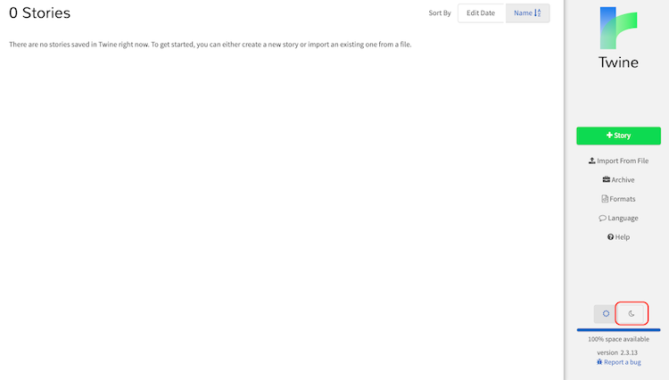

# Twine 2 Tutorial: Writing Your First Story
## Author: Brian Douglas Moakley

Twine is a Choose Your Own Adventure (CYOA) development environment. This is a tool that allows anyone with a little passion to write a branching story that you can share, sell or read on your own.

Twine is program developed by Chris Klimas. He originally wrote it as a desktop application but with the release of Twine 2, it is now a web app. This means Twine can run on any platform. All that is needed a modern web browser. While Twine has many contributors, Chris is the driving force behind the project. If you enjoy the software, support him on [Patreon](https://www.patreon.com/klembot)

Twine is a free tool and the stories made with it are yours. This is different than say a competing product known as ChoiceScript where you need permission to sell your story.

This tutorial will teach you the basics of Twine to get started.

In this tutorial, you’ll do the following:

* Start Twine and create your first story.
* Learn about passages and how to connect them together.
* Publish your work for all to see. 

This tutorial is the first in a series of tutorials to provide comprehensive coverage about writing branching narratives using Twine.

### Launching Twine

There a many different ways to use Twine. You can access Twine from the official web site. You can download a Twine client and work locally. You can also write your stories outside of Twine and build your story using a tool called Twee2.

To get started working with Twine, head over to https://www.twinery.org. 

You’ll notice a yellow post-it note on the right hand side of the web page. For the sake of this demo, click **Use it online**.

| Current Twine homepage as of 2019 |

Since this is your first time using Twine, you'll get a notification, asking if you'd like to know some important things about the Twine environment. 

In a typical desktop app, you load files from your hard drive and save them back to the hard drive when you are done with them. With Twine, the application lives in your web browser. This means, when you save your story, you save it in the web browser. 

A saved story in one browser is not accessible in another browser. If you save a story in Chrome, and launch Twine in Firefox, Twine won't "see" your saved stories. 

Keeping your stories saved in the browser poses another issue. If you decide to clear out your browser data, you may delete your story. Unfortunately, there's no way to recover your story. 

Thankfully, Twine allows you to save your stories locally to your computer. If your browser loses your story, you can simply import your local file back into Twine. When you finish working with Twine, always make it a habit to save your story to disk. You'll learn how to do this later in the tutorial.

Also note, these rules apply to the Twine downloadable app as well. 

Click on the Tell Me More button to learn more about working with Twine and when you are done, you'll be presented the story list.

### Creating a New Story

When you start Twine, you'll be presented with the story list. You can think of this as a desktop. This is where all your stories live.

You can change the style of the Twine environment to "dark mode" by clicking the moon icon. 

| Dark mode helps with eye strain. |

Dark mode is great to prevent eye strain. Dark mode looks a little bit different, but it is functionally the same. 

| I prefer dark mode but it's definitely an acquired taste. |

For the purposes of this tutorial, I've used the regular mode. 

Since you want to create a new story, click the + Story button on the right-hand column.

| Every new story starts with a click of the green button |

You'll be prompted for the story's name. Call it: **Bernie's Revenge**. Then, click the **Add** button.

In this story, you're a lone boy scout trapped in a Summer camp. The camp cook, Bernie, has given everyone food poisoning by way of his chili. Now, he wants you to try it, but you must escape before he gets to you!

The story that you will write in this tutorial series is a game. This is intentional so you can play with a lot of Twine's cool features. Your own story can have only a few branches. It can adapt based on user input. It can be just a linear story. Or it can be a narrative adventure. This is no right way or wrong way to write a Twine story 

### Passing the Time with Passages

When your story starts, you'll be presented with the Twine workspace. It contains only one passage. This is the starting point of your story. 

A Twine story is composed of a series of connected passages which beg the question – what’s a passage? The answer isn’t so obvious. A passage is whatever you mean it to be.

In short, a passage represents a block of text or code. It could represent an entire room, a paragraph in an essay, or even just a singular word. In short, passages provide structure to your story.

Passages connect to each other which allows the user to traverse your story. A passage can connect to any other passages and they are allowed multiple connections. In time, you’ll create a large network of passages that forms your story.

| This is a series of passages I wrote for my story, “Cold Storage”. The interface is set to dark mode. |

You can also create passages without connections or even islands of passages. These passages can sometimes be used by Twine to load in additional settings. You can also embed those passages in other passages or send the user to them when they are running the game.

You’ll notice your first passage contains a green icon of a rocket ship in the upper left-hand corner.

This indicates that the passage is your starting passage. This is the first passage that is displayed to the reader. Double click the passage and you’ll see a new dialog.

This is where you write your story.

The first text field is the title of the passage. The passage title is only for you. It is not shown to the end-user. Give it the name: **Camp Entrance**.

The next fields allow you to add tags to your passage. You can use tags to programmatically access passages. Different story formats use tags in different uses. You’ll learn more about story formats in another tutorial.

Recently added in Twine is a toolbar full of ways to format your text and quick access to some programmatic features. If you find this distracting, you can click the black caret button.

| A useful toolbar to format your code but it can be a bit distracting. |

The final field is the passage text. This is the text that the user will read. Add the following: **A dusty dirt strewn road leads into the darkness to the southeast. A sign next to the road reads, “Camp Center”.**

Your passage should now look like the following:

Now to create a second passage. Close the dialog by either clicking the X button in the corner or clicking outside the dialog. Next, click the green + passage button. You can find it in the lower right-hand corner of the interface.

This creates a passage next to your existing one. You click and drag it around the interface to reposition it. This is helpful to group related passages together.

In this story, each passage represents a different location. This doesn’t have to be the case for your story. You could have a passage represent a paragraph, a character description, an inventory screen, or even just a line of text. I’m writing a story called “Topsy Turvy” where passages represent moments between two characters. Later, they represent individual locations.

Your new location is to the southeast of the entrance, so move it to the southeast of the passage.

When I use passages as map locations, I like to logically position them. That way, I always know where to find my passages. If you are using passages in different ways, spend a little time with your organization so you understand the layout of your story at a glance.

Double click your new passage. Give it the name: **Dusty Road**

For the description, add the following: **You walk along the main camp road. The dust-strewn road leads back into the darkness towards the entrance of the camp.**

Now that you have two passages, your next task is linking them together.

### Linking Passages

When creating Twine stories, you create a network of passages. Readers can then traverse between various passages based on their choices. In some cases, they can even backtrack.

You create your passage links in the text. Links are designated by double brackets: [[ ]]

Links must always contain a passage destination. Double click the Camp Entrance. At the bottom of the passage, add the following: **[[Run Away]]**

You’ll notice that once you start typing, you’ll be presented with destination options for the link. Ignore those for now.

When adding your link, you’ll see a new passage named “Run Away”, connected with an arrow. The arrow indicates the direction of the passage.

In this case, the player the arrow points from the Camp Entrance passage to the Run Away passage. This means the link is a one-way link. When the user clicks on the Run Away link in the Camp Entrance, they’ll be taken to the Run Away passage, but there’s no link back to the Camp Entrance.

You don’t need this new passage. Click on the Run Away passage and you’ll see an option toolbar appear on the passage. Click the trash icon to delete the passage.

When you click the trash icon, you’ll be prompted with a dialog, confirming the delete action.

Click the **delete** button. This deletes the current passage, creating an orphaned link. Twine lets you know about the orphaned link by placing a red X over the link.

Since you won’t be allowing the player to run away (mah-haw-haw), double click the Camp Entrance and **remove the [[Run Away]] text.**

Your task is to link the Camp Entrance passage to the Dusty Road passage. This time, you’ll provide custom for the link.

**Double click the Camp Entrance passage** to open it. Replace **dusty dirt strewn road** with **[[dusty dirt strewn road->Dusty Road]]**

This links up the two passages. The ‘dusty dirt road’ is the link text. After which, you private a custom arrow: ->. This arrow points where the text should go. In this case, it points toward the Dusty Road.

Keep in mind, that spelling and capitalization are important. For example, Twine sees the _Dusty Road_ location different than the _dusty Road_.

You’ll see that the passages are linked together:

You may fill out the passage exactly as I did, but end up with two Dusty Road passages. One passage is your existing Dusty Road passage and the other is a new one.

Passage names are case-sensitive, meaning “Dusty Road” is different than “dusty road”. Also, an empty space is considered a character so “Dusty Road” is different than “Dusty Road “.

This is the same with passage links. For example, this code: **[[dusty dirt road->Dusty Road ]]** links to the “Dusty Road ” passage. This means if you have strange unexpected passages, check your passage names.

Passage links also adapt to different languages. If your language is written from right to left, you can reverse the link order by also flipping the arrow. So this **[[dusty dirt road->Dusty Road]]** is the same as this: **[[Dusty Road<-dusty dirt road]]**

Now, to link the Dusty Road back to the Camp Entrance. **Double click on the Dusty Road passage.** Replace the **entrance of the camp** with **[[entrance of the camp->Camp Entrance]]**. Now both passages are connected with each other.

Now, all you need to do is play your small story. Click the play button to run your story.

A new browser window or tab will open with your new Twine story ready to go. Make sure to read your story and click the links.

Congrats! You’ve created your very first Twine story. The default look and feel of the story are defined by the story format. You are using the Harlowe story format which is the default story format for Twine.

If you were to use the SugarCube story format, your story will look like the following:
A screenshot showing the story being used in SugarCube.

Your Twine story viewed using SugarCube

While story formats provide the default look and feel, they also define how you write your story. In fact, choosing a story format is one of the most important choices you’ll make when working with Twine. You’ll learn more about story formats in an upcoming tutorial.

### Exporting Your Story

When you complete your story, you will want to share it or at the very least, save a backup of your story. Twine offers a few ways of exporting your story.

The first thing you may want to do is create a proofing copy. A proofing copy exports your story out of Twine and in a format that provides just the text. That way, you can print out your story and proofread it for any errors.

With your story still open, click on the story name. You’ll be presented with a few options. Click the View Proofing Copy.

The proofing copy doesn’t remove any of your story code. Rather, it just sequentially lists your passages with all of your text.

A proofing copy provides an editor-friendly view of your story.

Once you have proofed your story, you may want to publish your story. When you publish your story, you aren’t publishing it for the world to see, rather you are saving it to a file. You can then upload that file to a game server like itch.io or embed it into a mobile app.

Click your story name and then select, Publish to File.

Doing so will produce an HTML file. This is your published story. To play it, just open it up in any browser. You can also import this story into Twine whereby you can edit it.

This is your backup file. Make it a habit to publish your file at the end of every writing session so you don’t lose it.

To import the story back into Twine, you use the story list. On the right-hand side of the story list, click the Import from File option and then select you.

Now you can save your story out of Twine and import it back into it.
Where to Go from Here

Congrats on writing your very first Twine story. In subsequent tutorials, you’ll build on Bernie’s Revenge and add some awesome features to it.

Your next task is to build all the passages in the story that compose the campground and link them all together. You’ll do this in the next tutorial.

#### License: CC BY 4.0 
#### This license requires that reusers give credit to the creator. It allows reusers to distribute, remix, adapt, and build upon the material in any medium or format, even for commercial purposes. 
