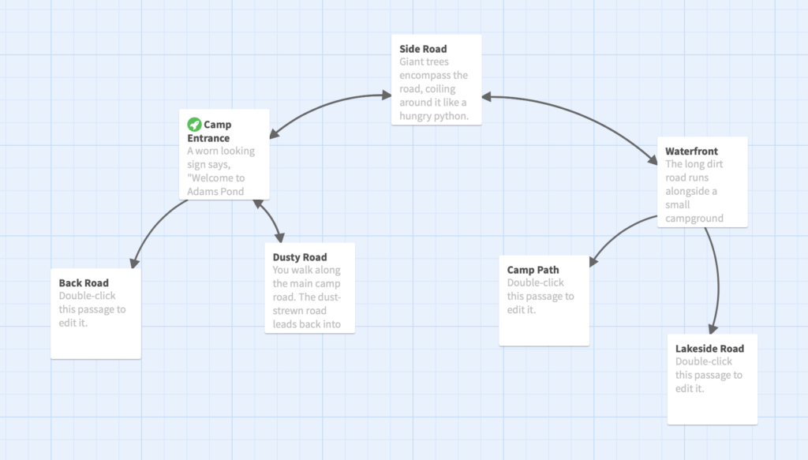

# Twine 2 Tutorial: Adding More Locations
## Author: Brian Douglas Moakley

Passages are the bread and butter of creating interactive stories in Twine. You don’t have a story without them. Passages can represent anything in a story. For instance, you can use them to represent a place like the moon, a thought in a character’s head, or even a single line of dialog.

Combined with Twine coding, you can use them to run specific code that be accessed from anywhere in your story. You’ll learn how to do this later in this tutorial series. For now, it’s time for you to get practice building passages and linking them together.

In this tutorial, you’ll do the following:

* Add all the locations for the story as passages
* Connect the passages together
* Organize all the passages to match the play space

As you can see, there’s a lot to do, so break out your favorite beverage and shut the door. You have some Twin’ing to do.

### Building the Story

In the previous tutorial, you learned how to write a very simple story. You’ll build on that progress by adding a series of locations. If you haven’t completed that tutorial, take the time to go through it and come back here. 

If you haven’t completed the last tutorial and nevertheless wish to continue, feel free to download the starter story for this challenge. 

**Note:** If you are using the starter story, you’ll have to import it into Twine using the Twine dashboard.

In this Twine tutorial, you’ll add the rest of the locations. By the end of the tutorial, you’ll wind up with a lot of passages. That’s just part of working with Twine. Unfortunately, more passages means more confusion. Take a look at the structure of this story:

As you can see, this story organization is a little hard to follow. A good best practice is to determine your organization ahead of time and then be consistent with it.

In Bernie’s Revenge, you’ll organize the story like a map. That way, the passages will physically match the layout in the story. The map does contain a couple of requirements.

First, the dining hall can only be passed through from east to west. It’s essentially, a one-way set of passages. Next, there is a forest path that can only be accessed if the player has a flashlight. This will be handled in code.

To get started, open Bernie’s Revenge from when you last worked on it (or import the starter story)

When you last left off, you had two passages.

Now to start by **adding a new passage**. 

**Note:** I won’t be covering topics that were previously covered in past tutorials. If you don’t know how to add a passage, then check out the previous tutorial.

Give it the name, **Side Road**. Give it the following description: 

**Giant trees encompass the road, coiling around it like a hungry python. Not a bird squawks. Not a peeper peeps. Anything could be out there. You just hope it doesn't have chili.**

**The [[road continues->Camp Entrance]] into the darkness to the southwest. The road also turns a [[sharp bend->Waterfront]] and disappears to the southeast.**

Now arrange the passages according to the description. The _Camp Entrance_ is to the southwest of the _Side Road_ and the _Waterfront_ to the southeast of it.

You’ll notice that the _Side Road_ contains just a one-way transition. Open up _Camp Entrance_ and update the description to the following:

**A worn looking sign says, "Welcome to Adams Pond Scout Camp" yet there the surrounding forest loom heavy and foreboding like the night that engulfs it.**

**A [[dusty dirt strewn road->Dusty Road]] leads into the darkness to southeast. A sign next to the road reads, "Camp Center". A [[side road->Side Road]] branches off to the northeast. A sign next to it reads: "Waterfront". Finally, [[a graveled strewn road->Back Road]] goes to the southwest. A sign next to it reads: "Facilities"**

The _Side Road_ now gains a two-way transition but you also added a new passage called _Back Road_. Move the _Back Road_ to the southwest to the _Camp Entrance_. It should look like the following:

Your campground is now starting to take shape. 

### Understanding the Structure

In the following section, I’ll provide the text for the rest of the passages. You’ll notice that I’m providing everything in compass directions. This is actually really antiquated. I grew up playing text adventures where you switch locations by typing, “go north” or “n”.

These traditions grew out of an expectation that the player was actually mapping along with the story. Some of these maps became so elaborate, `Infocom` (a developer of interactive fiction) sold maps along with their `InvisiClues` hint books.

Twine there is no expectation. That said, each Twine story is its own monster so when I wrote this story, I decided to go old school. I figured it was easy to conceptualize the layout of the passages. 

### Adding the Rest of the Passages

Without further adieu, here are the passages.

First start with the _Waterfront_. Add the following to the description:

**The long dirt road runs alongside a small campground beach. You see rowboats, canoes, and an assortment of life vests scattered on the ground. Evidently, when the chili hit, people were in the middle of the lake.**

**A [[small path->Camp Path]] leads into the darkness to the southwest. It looks like a short cut to another campground, but you can't tell for sure.**

**The [[road->Lakeside Road]] to the south leads back to the center of camp. The road also [[continues past the beach->Side Road]] around a sharp bend to the northwest.**

Then arrange the passage to the following:

Next, open the _Lakeside Road_ passage and update the description to the following:

**A long dirt road follows the edge of lake. The lake glimmers in the moonlight making your stomach twist. It reminds you of Friday the 13th although Jason, mercifully, had a machete instead of chili.**

**The [[road->Waterfront]] leads to what looks like campground beach to the north. It also [[leads to to the craft station->Crafts Station]] in the center of camp to the south.**

Then arrange the passage to the following:

Now open the _Crafts Station_ and change the description to be:

**A [[long winding road->Intersection]] snakes past a small stall filled with picnic tables to the southwest. From all the wood shavings on the ground, it's clear that the stall is used to teach wood working. The road winds by the stall and disappears around [[a bend->Lakeside Road]] to the north.**

Then arrange the passages to resemble the following:

Next update _Intersection‘s_ description to the following:

**A group of dirt roads meet to form a large intersection. [[One road->Dusty Road]] leads into the darkness to the northwest. [[Another road->Parade Ground]] leads into large open space to the west. From a distant hanging light, it looks almost like parking lot. The [[last road->Crafts Station]] snakes by a group of picnic tables underneath an open wooden roof to the northeast.**

Once done, arrange the passages to the following:

Next, update the _Parade Ground_ passage description to the following:

**A [[long dirt road->Intersection]] winds up to a large circular patch of asphalt to the east. It is a parade ground where all the different campsites line up for dinner. A [[large wooden mess hall->Mess Hall]] is nestled into tress just outside the meeting area.**

**Outside the campground is [[small wooden building->Store]] that looks like a small wind could knock it over. The sign outside it reads: "Company Store"**

You’ll get two new passages: the _Store_ and the _Mess Hall_. Arrange them like so:

Next, update the _Store’s_ description to the following:

**The camp store is a small room with a simple counter and shelves of goodies. Everything is gone. Evidently, as Bernie's chili took effect, there was a mass rush on the store in hopes of finding anything to alleviate it.**

**A door leads back to [[Parade Ground]]**

With the store complete, now open the _Mess Hall_ passage. Add the following description:

**You push open the spring door of the mess hall and as you step into it, the door snaps shut behind you. You pull on the door, but can't get it open again.**

**Turning back, you see that the mess hall is filled tables. Abandoned bowls of chili line all the tables. You realize this is ground zero. Bernie served the chili and soon afterwards was the stampede towards the latrines.**

**Not like this, you whisper. Not like this.**

**Another spring door leads out to the [[back of the mess hall->Soccer Field]]. You realize that once you step out, you won't be able to get back in.**

This is a one way location. If the player enters the mess, they must leave to the _Soccer Field_ passage.

Arrange the passages like so:

Now for the _Soccer Field_ passage. Add the following description:

**A large soccer field glistens in the night air. From the all the impressed tire tracks, it looks to have been a used as a makeshift parking lot as well. A large wooden building sits next to the soccer field. A door leads into it, but there is no handle to open it.**

**A [[gravel road->Back Road]] leads from the soccer field and into the night to the northwest.**

At this point, your playfield is coming together nicely. You can see that the main play area looks to be a circle. 

At this point, you are going to add passages to bisect the circle. Update the _Back Road_ passage to the following:

**A small gravel strewn road looks to encircle the entire camp. It continues to a [[wooden building->Soccer Field]] into the southeast. A [[small path->Hopi Campground]] leads to a campground to the east. It bends in the other direction to what looks to be the [[camp entrance->Camp Entrance]] in the northeast.**

This passage adds a new passage that is the _Hopi Campground_ passage. This should go to the right of the Back Road passage.

Now to finish the passages in the middle of the circle. Open the _Hopi Campground_. Set the description to the following:

**Although the faint embers of coals still glow in the campground, the place is empty although you see neglected backpacks on the ground and an assortment of camping gear. Bernie's chili drove people to the hospital in a hurry that there was no time to clean up.**

**A [[small path->Dusty Road]] leads to the main road to the east whereas another path leads through the campground to what looks to be a [[back road->Back Road]] to the west.**

This connects the _Hopi Campground_ with the _Dusty Road_. Unfortunately, the connection is a one-way connection. 

Open the _Dusty Road_ passage. Set the description to the following:

**A long dirt strewn road leads back into the darkness towards the [[entrance of the camp->Camp Entrance]] to the northwest. It [[continues onwards->Intersection]] into the night to the southeast. Towards the center of the camp.**

**A [[path->Hopi Campground]] leads into a clusters of canvas tents to the west. The sign  next to the path reads: Hopi Campsite. Across the road is [[another clusters of tents->Tombstone Campground]] to the east. A sign reads: Tombstone Campsite.**

This makes a two-way connection between the _Dusty Road_ passage and the _Hopi Campground_ passage. It also creates a _Tombstone Campground_. Move _Tombstone Campground_ to the right of the _Dusty Road_.

Now open the _Tombstone Campground_ passage. Set the description to the following:

**You find yourself in another campsite. It's a bunch of canvas tents huddled close together. The discarded gear from the residents lie scattered all over the place. The chili looks to have hit the group hard.**

**Outside the tents, you spy a large tombstone. It is monument to the founder of the camp, yet an empty bowl of chili lies at its base. Chills run up and down your spine.**

**Beyond the trees, you see a [[road->Dusty Road]] to the west. A [[path->Camp Path]] leads into the woods to the northeast. It looks dark and menacing.**

Now the _Tombstone Campground_ passage is all set up and connected to the _Camp Path_. The path requires a flashlight to use it but you’ll add that in code.

You passages should look like the following:

Now open the _Camp Path_ passage and set the description to the following:

**Even with the flashlight, the winding path through the forest is impossible. Yet, you feel at east since you know Bernie doesn't have a light and would never be able to follow you.**

**The path [[leads up a hill->Tombstone Campground]] to what looks like a campground. Down the hill, you think it [[leads to the waterfront->Waterfront]].**

Reaching this passage means you have the flashlight which is why it is mentioned in the description. And with that last passage, your passages should look like the following: 

Congratulations! You have your first story setup. Granted, there’s a lot let to add, but the skeleton is in place.

### Where to go from here?

With your structure in place, it’s time to start building in earnest and that means learning code. In the next tutorial, you’ll be introduced to the Harlowe story format and you’ll learn why Twine coding is actually quite accessible. 

In the meantime, make your own story, and feel free to post a link in the comments. See you in the next tutorial!

#### License: CC BY 4.0 
#### This license requires that reusers give credit to the creator. It allows reusers to distribute, remix, adapt, and build upon the material in any medium or format, even for commercial purposes. 
